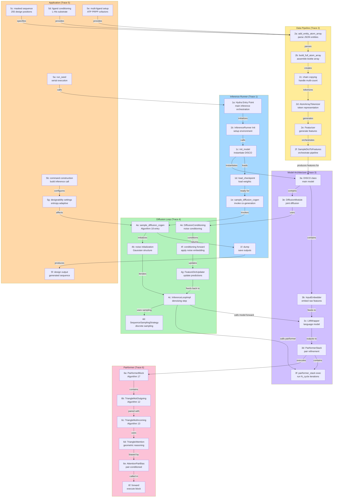

# Local environment and visualization conventions

This reference mirrors the user's pasted specification from `/root/.hermes/pastes/paste_1_090129.txt` as closely as possible so the skill can follow it exactly.

## Exact execution defaults

Before execution:
```bash
export HF_ENDPOINT=https://hf-mirror.com
```

Necessary do `npx skills` then to execute.

```bash
npx skills
```

Aliyun download / install command for `.uv-magi`:
```bash
uv pip install --python .uv-magi/bin/python torch torchvision torchaudio --find-links https://mirrors.aliyun.com/pytorch-wheels/cu124/
```

Use conda python:
```bash
/home/qiao/anaconda3/bin/python
```

## Global visualization palette and style

Removed NarQ and NarL specific tags. Merged duplicate grape purple. 15 core colors remain, ordered from cool to warm. Auxiliary colors are for fills, confidence bands, or light backgrounds.

### Color table

| No | Name | Primary | Auxiliary |
| --- | --- | --- | --- |
| 10 | 葡萄紫 | #652884 | #A588B9 |
| 16 | 玫紫 | #B46DA9 | #DBAFD3 |
| 12 | 褐赭 | #8A7355 | #C6B9A7 |
| 13 | 砖红 | #CC5B45 | #E9ABA0 |
| 15 | 鲜红 | #E42320 | #F19290 |
| 04 | 亮橙 | #F5A216 | #FFD485 |
| 03 | 芥末黄 | #D9A421 | #F3D17F |
| 14 | 铅灰 | #848484 | #C1C1C1 |

**Emphasis line for thresholds**: #D0021B

### Global Matplotlib style

```python
import matplotlib.pyplot as plt
import seaborn as sns

PALETTE = [
    "#458A74", "#018B38", "#57AF37",
    "#41B9C1", "#008B8B", "#4E5689",
    "#6A8EC9", "#652884", "#B46DA9",
    "#8A7355", "#CC5B45", "#E42320",
    "#F5A216", "#D9A421", "#848484"
]

AUX_PALETTE = [
    "#92C1AF", "#89D0A4", "#A6D993",
    "#A7E1E4", "#86C9C9", "#9FA5C7",
    "#B3C6E7", "#A588B9", "#DBAFD3",
    "#C6B9A7", "#E9ABA0", "#F19290",
    "#FFD485", "#F3D17F", "#C1C1C1"
]

plt.style.use('seaborn-v0_8-whitegrid')
plt.rcParams.update({
    "figure.dpi": 300,
    "axes.edgecolor": "#444444",
    "axes.linewidth": 0.8,
    "grid.color": "#D7D7D7",
    "grid.linestyle": "--",
    "grid.alpha": 0.6,
    "font.size": 10,
    "legend.frameon": False,
    "axes.prop_cycle": plt.cycler(color=PALETTE)
})

sns.set_palette(sns.color_palette("deep", n_colors=8))
```

### iPTM plot template

Fixed y range 0 to 1. Legend placed outside to avoid data occlusion.

```python
def plot_iptm(ax, x, data_dict, threshold=None):
    for name, y in data_dict.items():
        ax.plot(x, y, label=name, linewidth=1.5)
    if threshold is not None:
        ax.axhline(threshold, color="#D0021B", linestyle=":", linewidth=1)
    ax.set_ylim(0, 1)
    ax.set_ylabel("iPTM")
    ax.legend(bbox_to_anchor=(1.02, 1), loc="upper left", frameon=False)
```

### Cycle visualization

Use seaborn deep palette. No rectangle markers. Color alone identifies cycles.

```python
def plot_cycles(ax, df, x_col="x", y_col="y", cycle_col="cycle"):
    n = df[cycle_col].nunique()
    palette = sns.color_palette("deep", n_colors=n)
    for i, (name, g) in enumerate(df.groupby(cycle_col)):
        ax.scatter(g[x_col], g[y_col], color=palette[i], s=22, label=str(name), alpha=0.85)
    ax.legend(bbox_to_anchor=(1.02, 1), loc="upper left", frameon=False)
```

### Usage guidelines

- Limit to 5 primary colors per figure. Switch to deep palette if more groups needed
- Use auxiliary colors only for fill_between or transparent backgrounds. Keep main lines opaque
- Threshold or emphasis lines always use #D0021B dotted, linewidth 1
- Place legends outside with bbox_to_anchor 1.02, 1
- Keep 300 dpi, axes edge #444444, grid dashed alpha 0.6
- Lead gray #848484 reserved for controls or reference

## Mermaid flowchart template reference

These flowchart templates should be used as reference.



## Ambiguity resolution

The source line "necessary do npx skills then to excute" is interpreted conservatively as: run `npx skills` before executing the main workflow when bootstrap/setup is required. All exact command strings and plotting/diagram conventions above are preserved verbatim.