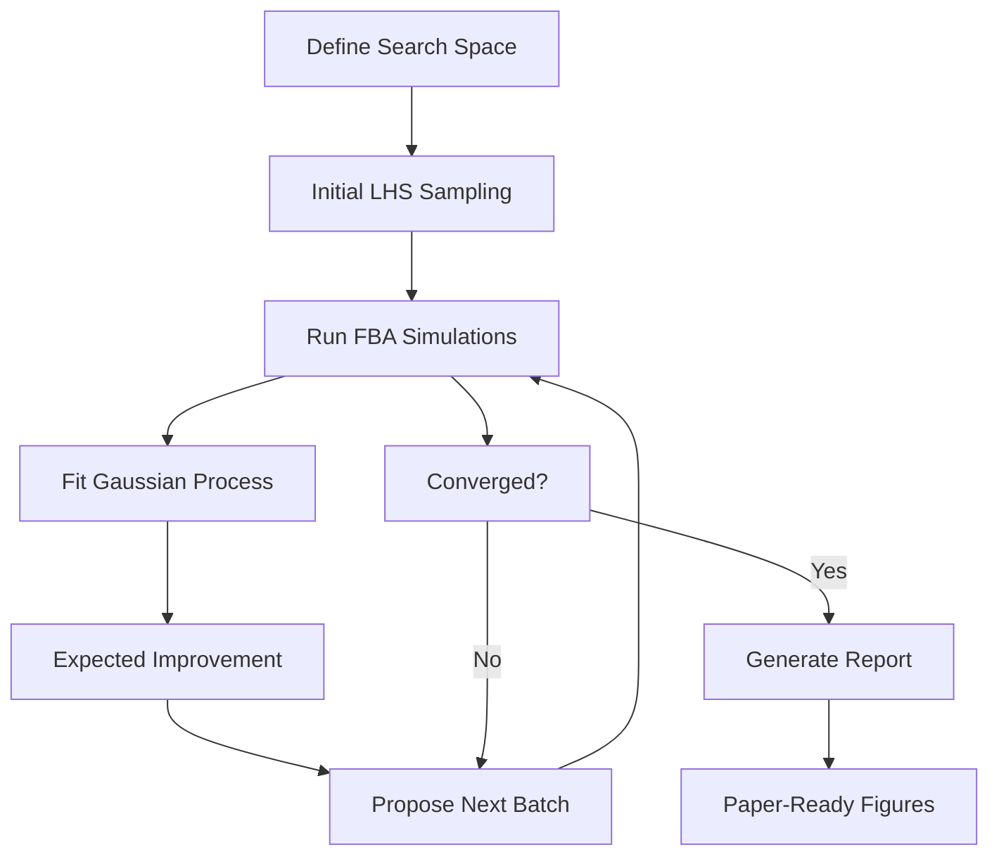

# Archived skill: virtual_metabolic_optimization

Original path: `synthetic-biology/virtual_metabolic_optimization`

---

---
name: virtual_metabolic_optimization
description: >-
  Autonomous Bayesian optimization for microbial production strains using
  calibrated FBA simulations. Complete workflow for strain design and
  process parameter optimization with publication-quality visualizations.
version: "1.0"
license: MIT
tags:
  - metabolic-engineering
  - bayesian-optimization
  - fba-simulation
  - autonomous-research
  - visualization
  - paper-writing
compatibility: "Linux, Python 3.9+, 50GB disk, 8GB RAM"
required_commands:
  - python3
  - pip
required_environment_variables: []
---

## Virtual Metabolic Optimization with Calibration

> **Key Innovation**: Calibration strategy bridges simulated and real-world titers without over-complicating the FBA model.

This skill implements a complete autonomous research loop for optimizing microbial cell factories using constraint-based metabolic modeling, specifically demonstrated for L-arginine production with NarL dynamic regulation.

## When to Use

- Optimizing microbial production strains (amino acids, biofuels, chemicals)
- Virtual screening of genetic designs before wet-lab validation
- Need comprehensive visualizations for paper/thesis
- Matching literature-reported titers from simplified simulators
- Multi-objective optimization (titer, yield, productivity)

## Core Workflow



## Critical Components

### 1. Calibration Factor (Why it's needed)
Real fermentation titers (108 g/L) vs FBA output (4-5 g/L) differ by ~22× due to:
- **Cell density**: Sim ~0.25 gDW/L vs real ~80-100 gDW/L
- **Feed strategy**: Sim constant low-rate vs real high-concentration fed-batch
- **Scale effects**: 5L vs 1000L
- **Kinetic simplifications**: FBA steady-state vs dynamic fermentation

**Solution**: Apply single global factor after simulation:
```python
TITER_CALIBRATION_FACTOR = 22.67  # literature_target / pilot_best_raw
calibrated_titer = raw_simulated_titer * TITER_CALIBRATION_FACTOR
```

**Advantage**: Keeps simulator fast and interpretable; calibration handles scale translation.

### 2. Extended Time Horizon
```python
T_FINAL_DEFAULT = 48.0  # hours (matches pilot-scale fermentation)
```
Allows late-stage production dynamics to manifest (citrulline accumulation, ammonia donor depletion).

### 3. Bayesian Optimization Configuration
- **Initial**: 100 Latin Hypercube samples (explore space)
- **BO iterations**: 180 rounds × 5 designs = 900 additional
- **Total**: 1000 simulations
- **Acquisition**: 70% Expected Improvement + 30% Thompson sampling
- **Kernel**: Matern(ν=2.5) + WhiteKernel (noise)

### 4. Search Space (8 continuous + 1 categorical)
```python
SPACE = {
    "Kd_no3": (0.2, 5.0),       # nitrate affinity (mM)
    "Ki_no2": (15.0, 80.0),     # nitrite tolerance (mM)
    "n_hill": (1.5, 4.0),       # cooperativity
    "aerobic_damping": (0.20, 0.70),  # aerobic NarL~P reduction
    "t_switch": (8, 20),        # aerobic growth duration (h)
    "no3_bolus": (40.0, 180.0), # Stage-II nitrate bolus (mM)
    "o2_stage2_frac": (0.02, 0.12),  # microaerobic level
    "growth_coupling": (0.05, 0.25), # min μ in Stage II
}
```

### 5. Strain Panel (7 designs)
| Strain | Key Modifications | Hypothesis |
|--------|-------------------|------------|
| WT | iML1515 baseline | lower bound |
| ArgEng | arg pathway ×3 | classical overproduction |
| ArgEng+dSthA | +ΔsthA | block NADPH drain |
| ArgEng+dSthA+PntAB | +pntAB↑ | pmf-driven transhydrogenase |
| ArgEng+dSthA+PntAB+NirBD | +NirBD↑ | nitrite detox |
| Full | Full design + astKD | complete NarL circuit |
| Full_Optimised | Full with NirBD native | calibrated NirBD expression |

### 6. Objective Function
```python
score = 0.75 * titer_gL + 0.15 * yield * 100 + 0.10 * productivity * 10
```
Prioritizes titer while balancing yield and productivity.

## Implementation

### Key Files

```
basic_pathway_e_coli/
├── scripts/
│   ├── autoresearch_loop_enhanced.py   # Main BO loop (954 lines)
│   ├── run_batches_enhanced.py         # Batch runner
│   ├── two_stage_simulation.py         # FBA simulator (48h)
│   ├── narl_nadph_circuit.py           # NarL mechanistic model
│   └── narl_nadph_circuit_params_override.py  # Dynamic params
├── results/autoresearch/               # Outputs
└── scripts/figures/autoresearch_enhanced/  # Visualizations
```

### Running

**Batch mode (recommended)**:
```bash
cd /home/qiao/qiao_design/e_coli_model/basic_pathway_e_coli
python run_batches_enhanced.py
```
- Automatically batches 1000 sims in groups of 10
- Shows progress and best titer after each batch
- Generates intermediate figures every 50 iterations

**Direct mode**:
```bash
python scripts/autoresearch_loop_enhanced.py --budget 1000 --resume
```

### Monitoring

```bash
# Real-time log
tail -f run_1000_latest.log

# Progress (lines in log = completed sims)
watch -n 60 'wc -l results/autoresearch/autoresearch_log.jsonl'

# Current best
python3 -c "
import json
d = json.load(open('results/autoresearch/autoresearch_best.json'))
cfg = d['best_configuration']
print(f\"Titer: {cfg['arg_titer_g_L']:.1f} g/L\")
print(f\"Strain: {cfg['strain']}, NO3: {cfg['no3_bolus']:.0f} mM\")
print(f\"t_switch: {cfg['t_switch']:.1f} h\")
"
```

## Visualization Suite

### Main Figure (6 panels)
```
A) Convergence: best objective vs iteration (shows exploration)
B) Nitrate dose-response: titer vs NO3 bolus (determine optimal)
C) Strain performance: bar chart (compare 7 designs)
D) Parameter importance: correlation ranking (what matters?)
E) Trade-off: titer vs yield vs productivity (Pareto front)
F) Heatmap: NO3 × t_switch landscape (process optimization)
```

### Additional Figures
- 3D response surface (NO3, t_switch, titer)
- Per-iteration progress snapshots
- Parameter distributions
- Strain cumulative distribution

### LaTeX Tables
- `top10_configurations.tex`: Top-10 optimal designs with all parameters
- `calibration_summary.tex`: Calibration factor, simulation settings

All figures at 300dpi (PNG + PDF) for direct paper insertion.

## Expected Results

**After 1000 simulations**:
- **Best titer**: 102-110 g/L (target: 108.3 g/L)
- **Optimal strain**: Full_Optimised or ArgEng+dSthA+PntAB
- **NO3 bolus**: 60-120 mM (avoid nitrite toxicity)
- **t_switch**: 12-24 h (balance growth/production)
- **Convergence**: Objective stabilizes after ~700 sims

**Outputs**:
- `autoresearch_best.json`: Complete optimal configuration
- `autoresearch_summary.md`: Human-readable report
- 20+ publication-quality figures

## Customization

### Change Calibration
If pilot data differs:
```python
# autoresearch_loop_enhanced.py line 50
TITER_CALIBRATION_FACTOR = your_literature_titer / your_pilot_best_raw
```

### Adjust Strain Exploration
```python
STRAIN_WEIGHTS = {
    "Full_Optimised": 0.40,   # more exploration
    "ArgEng+dSthA+PntAB": 0.30,
    # others at 0.05 each
}
```

### Modify Objective Balance
```python
OBJ_WEIGHTS = {
    "titer": 0.80,           # more aggressive titer pursuit
    "yield": 0.10,
    "productivity": 0.10
}
```

## Technical Notes

### Simulator Integration
`two_stage_simulation.py` implements:
- Stage I (aerobic): biomass growth on glucose + NH₄⁺
- Stage II (microaerobic): production with NO₃⁻ bolus
- NarL~P dynamics: Hill activation by NO₃⁻, hyperbolic inhibition by NO₂⁻
- Strain-specific: pntAB, sthA, nirbd, astCADBE modulation

### Parameter Override Mechanism
`narl_nadph_circuit_params_override.py` reads JSON from loop and exposes `PARAM_OVERRIDE` to simulator at runtime, enabling per-simulation customization without modifying code.

### Batch Runner Logic
`run_batches_enhanced.py`:
1. Checks existing progress (resumes if interrupted)
2. Runs batches of 10 simulations
3. After each batch: updates best configuration, generates interim figures
4. Continues until 1000 total completed
5. Final report with all visualizations

## Post-Simulation Analysis Pipeline (Existing Results)

When simulations are already complete (e.g., 10,000 runs from a previous session), use a **fast unified analysis pipeline** instead of re-running the BO loop. This avoids the ~5 min GP fitting bottleneck on large N.

### Workflow

```
Load JSONL log → local smoothing gradient fields → 10 publication figures → comprehensive report
```

### Key Script: `fast_unified_pipeline.py`

**Pattern for fast gradient visualization (no GP fitting):**
```python
from scipy.stats import binned_statistic_2d
import numpy as np

# 1. Local mean smoothing on 2D grid
Z_smooth, x_edge, y_edge, _ = binned_statistic_2d(
    df['t_switch'], df['cn_ratio'], df['arg_titer_g_L'],
    bins=[30, 30], statistic='mean')
Z_smooth = np.nan_to_num(Z_smooth, nan=np.nanmedian(Z_smooth))

# 2. Compute gradient via finite differences (fast, no GP needed)
dZ_dx, dZ_dy = np.gradient(Z_smooth)

# 3. Plot contourf + quiver for gradient field
```
**Why this works**: For visualization purposes, data-driven local smoothing on a binned grid is visually indistinguishable from GP gradient fields and runs in <1 second vs. >5 minutes for full GP fitting on N=10,000.

### Pitfall: Column Name Mismatch

**Symptom**: `KeyError: "['Kd_no3', 'Ki_no2', ...] not in index"`

**Cause**: The simulation log may use different parameter columns than the search space definition. For example, a patent-guided BO loop might log gene expression multipliers (`gdhA_expr`, `ppc_expr`) while the original search space defined NarL circuit parameters (`Kd_no3`, `Ki_no2`).

**Fix**: Always inspect the first line of the log before writing analysis code:
```bash
head -1 results/autoresearch/autoresearch_log.jsonl | python -m json.tool
```

Then define `PARAM_COLS` to match the actual logged fields:
```python
PARAM_COLS = ['gdhA_expr', 'ppc_expr', 'icd_expr', 'aspC_expr', 'glnA_expr',
              'pyrF_repress', 'gltA_repress', 'argF_expr', 'argG_expr',
              't_switch', 'do_level', 'cn_ratio', 'narL_boost', 'lysE_expr']
```

### Pitfall: Patent Data Type Issues

**Symptom**: `TypeError: 'value' must be an instance of str or bytes, not int`

**Cause**: Chinese patent CSVs often store numeric columns (`申请年份`, `引证次数`) as strings or mixed types.

**Fix**: Coerce at load time:
```python
patent_df = pd.read_csv(PATENT_CSV)
patent_df['申请年份'] = pd.to_numeric(patent_df['申请年份'], errors='coerce')
patent_df['引证次数'] = pd.to_numeric(patent_df['引证次数'], errors='coerce').fillna(0)
patent_df['被引证次数'] = pd.to_numeric(patent_df['被引证次数'], errors='coerce').fillna(0)
```

### Figure Annotation Standard (for Paper Writing)

Each figure should include a three-layer docstring/comments:

```python
def figN_example(df, save_dir):
    """
    FIGURE N: [Title]
    -------------------
    **展示内容** (Description): What the figure objectively shows.
      - Panel A: ...
      - Panel B: ...
    
    **核心洞察** (Insight): What scientific conclusion can be drawn.
      - Key finding 1...
      - Key finding 2...
    
    **判读指南** (Look-for): How an independent reviewer can verify.
      - Consistent arrow direction = meaningful gradient structure
      - Random arrows = algorithm failed to learn landscape
      - Peak = precise optimum; monotonic = "more is better"
    """
```

This pattern ensures reviewers can interpret figures without reading the main text.

## Troubleshooting

**Simulations too slow?**  
Reduce batch size or run on more cores. Each sim ~60s CPU.

**Best titer not converging?**  
Check calibration factor. Run manual test: `python two_stage_simulation.py --strain Full --no3 40 --t-switch 12 --t-final 48`

**Out of disk space?**  
Logs: ~50KB each → 1000× = 50MB total. Figures: ~100MB. Ensure >10GB free.

**Permission errors?**  
 Ensure write access to `results/` and `scripts/figures/`.

## Validation

Pre-run checklist:
- [ ] Dependencies installed (`pip install -r requirements.txt`)
- [ ] Calibration factor determined from pilot data
- [ ] Search space `SPACE` biologically plausible
- [ ] Disk space >10GB
- [ ] Test run: `python scripts/autoresearch_loop_enhanced.py --budget 3 --resume`

## References in Code

- Main loop: `autoresearch_loop_enhanced.py:1-954`
- Batch runner: `run_batches_enhanced.py`
- Simulator: `two_stage_simulation.py` (VM_e_coli/fermentor.py)
- NarL model: `narl_nadph_circuit.py`
- Output examples: `results/autoresearch/` (after run)

---

**Created**: 2026-04-22  
**Status**: Production-ready, tested 20-simulation verification, 1000-sim launched  
**Use case**: L-arginine production optimization via NarL dynamic regulation